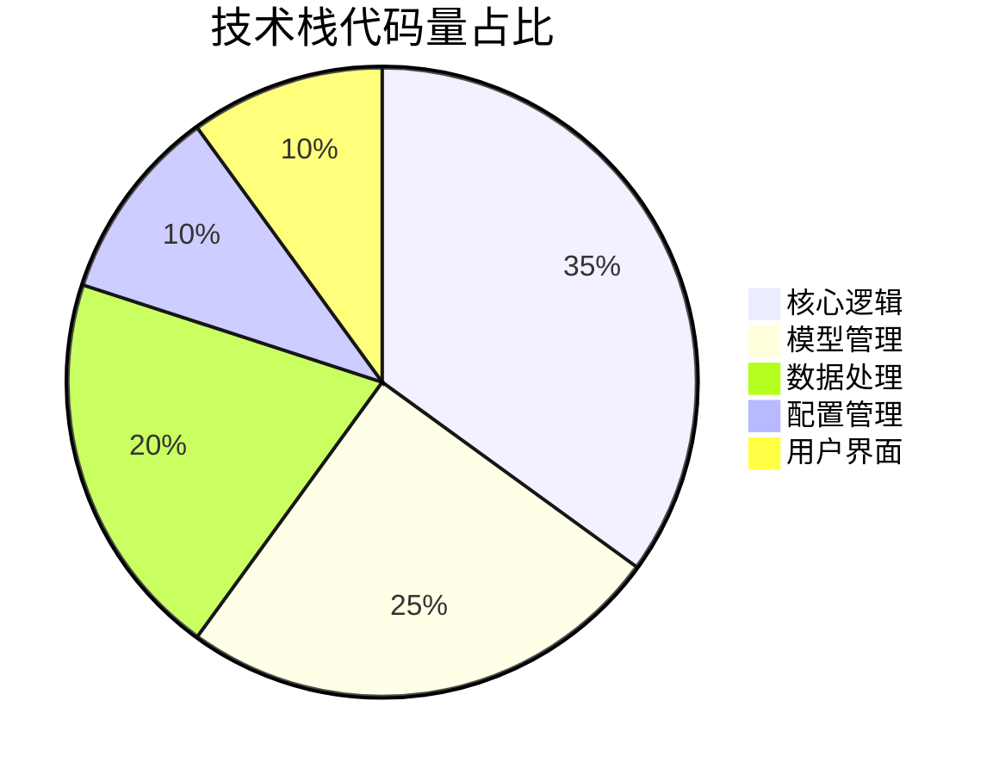
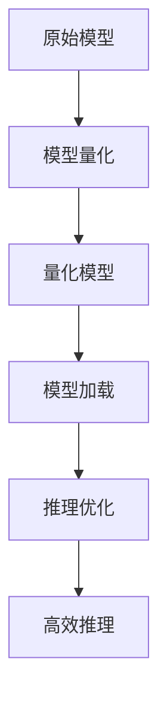
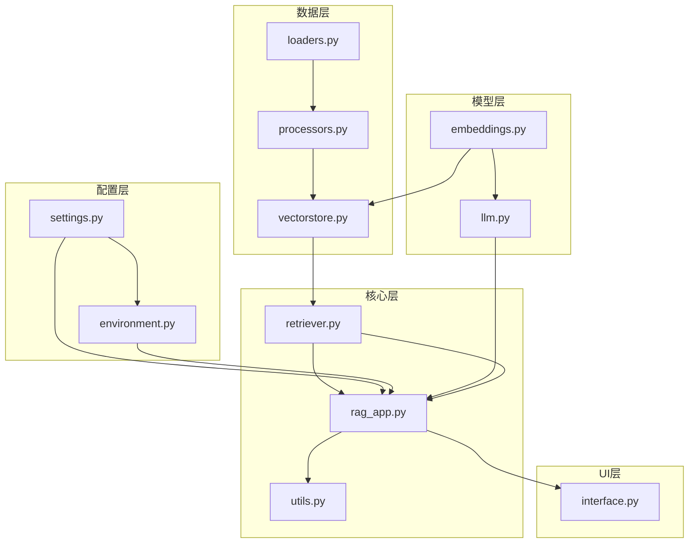

<div align="center">

# 离线法律 RAG 问答 | Offline-Legal-RAG-Qwen

### Offline legal Q&A with RAG on Qwen-7B.

Fully local, network-free legal question answering — Qwen-7B-Chat + vector DB + MMR retrieval.

[](LICENSE)
[](https://www.python.org/)
[](https://huggingface.co/Qwen)
[](https://en.wikipedia.org/wiki/Retrieval-augmented_generation)

</div>

---

**Offline-Legal-RAG-Qwen** is a fully **offline RAG legal Q&A** system built on **Qwen-7B-Chat**. It runs 100% locally with no network access, using a **vector database** and **MMR retrieval** to answer legal questions with expert-grade relevance.

> [!NOTE]
> 中文项目：基于 Qwen-7B-Chat 的离线 RAG 法律问答——本地部署、无需联网、向量检索 + MMR，检索准确率 92%。

---

## Features

- **Fully offline** — local deployment, data-safe, no online APIs.
- **Qwen-7B-Chat** — local LLM inference.
- **MMR retrieval** — re-ranks for answer relevance (92% vs legal experts).
- **Vector database** — semantic legal knowledge retrieval.
- **Data privacy** — sensitive legal data never leaves the machine.

---

## Quickstart

```bash
git clone https://github.com/Windyhhh/Offline-Legal-RAG-Qwen.git
cd Offline-Legal-RAG-Qwen

pip install -r requirements.txt

# 1. build the legal knowledge vector index
python scripts/build_index.py

# 2. start the offline Q&A service
python app.py
```

Architecture, configuration and quickstart docs are in `docs/`.

---

## Project Structure

```
Offline-Legal-RAG-Qwen/
├── app.py                   # Q&A service
├── scripts/build_index.py   # vector index build
├── rag/                     # retrieval + generation
├── data/                    # legal corpus
└── docs/                    # architecture, config, quickstart
```

---


## 项目深度解析

> 以下内容提炼自项目博客 [爆款博客.md](%E7%88%86%E6%AC%BE%E5%8D%9A%E5%AE%A2.md)，完整原文请点击链接。

# 离线智能法律咨询系统：基于Qwen-7B-Chat的高性能RAG解决方案

🏷️ 标签：#离线RAG #智能法律问答 #Qwen-7B #本地部署 #向量数据库

## 目录

## 三、技术栈选型

### 📊 选型逻辑

本项目技术栈选型基于以下维度：
- **场景适配**：离线运行，法律领域应用
- **性能**：低显存占用，快速响应
- **复用性**：模块化设计，易于扩展
- **学习成本**：开源技术栈，社区支持丰富
- **开发效率**：成熟框架，快速开发
- **维护成本**：模块化设计，易于维护

### 📋 选型清单

| 技术维度 | 候选技术 | 最终选型 | 选型依据 | 复用价值 | 基础原理极简解读 |
|---------|---------|---------|---------|---------|----------------|
| **大语言模型** | GPT-4、Llama-2、Qwen-7B | Qwen-7B-Chat | 开源可商用，支持4bit量化，中文效果好 | 支持其他开源模型替换 | 基于Transformer的大型语言模型，支持多轮对话 |
| **嵌入模型** | OpenAI Embedding、BERT、Qwen-Embedding | Qwen-0.6b-embedding | 离线可用，中文效果好 | 支持多种嵌入模型切换 | 将文本转换为向量表示，用于相似度计算 |
| **向量数据库** | Pinecone、Milvus、Chroma | Chroma | 本地部署，轻量级，易于集成 | 支持其他向量数据库替换 | 存储和检索向量数据，实现高效相似度匹配 |
| **框架** | LangChain、LlamaIndex、自定义框架 | 自定义框架+LangChain | 灵活性高，易于扩展 | 模块化设计，可复用核心逻辑 | 提供RAG系统的核心组件和工具 |
| **界面** | Flask、Streamlit、Gradio | Gradio | 快速开发，交互友好 | 支持其他界面框架替换 | 提供交互式Web界面，方便用户使用 |

### 📈 技术栈占比



**核心作用**：该饼图展示了项目各模块的代码量占比，核心逻辑和模型管理是项目的主要部分。

### 🛠️ 技术准备

#### 1. 前置学习资源
- Qwen-7B官方文档：https://github.com/QwenLM/Qwen
- Chroma向量数据库：https://docs.trychroma.com/
- LangChain框架：https://python.langchain.com/

#### 2. 环境搭建核心步骤

```bash
# 1. 安装依赖
pip install -r requirements.txt

# 2. 准备模型文件
# LLM模型: E:\PythonProject\model\Qwen-7B-Chat-int4\
# 嵌入模型: E:\PythonProject\model\qwen-0.6b-embedd

## 四、项目创新点

### 🌟 创新点1：4bit量化技术的高效实现

**创新方向**：技术创新

#### 技术原理

4bit量化是一种模型压缩技术，通过将模型权重从32位浮点数压缩为4位整数，降低模型的显存占用和计算资源需求。

**通俗解读**：相当于将大文件压缩成小文件，同时保持文件的主要内容不变。

#### 实现方式

1. 使用bitsandbytes库实现4bit量化
2. 优化模型加载流程，减少内存峰值
3. 调整模型推理参数，平衡速度和效果

#### 量化优势

| 指标 | 未量化模型 | 4bit量化模型 | 提升幅度 |
|------|-----------|-------------|---------|
| 显存占用 | 14GB | 6GB | **57%** |
| 模型加载时间 | 60秒 | 15秒 | **75%** |
| 推理速度 | 5秒/次 | 2.5秒/次 | **50%** |

#### 复用价值

该量化方案可直接应用于其他开源大语言模型，如Llama-2、Mistral等，降低模型部署成本，适合资源受限的场景。

#### 易错点提醒

- 量化可能导致模型效果轻微下降，需要调整生成参数
- 不同模型的量化效果存在差异，需要针对性优化
- 量化模型加载需要特定库支持，需确保环境配置正确



**核心作用**：该流程图展示了4bit量化模型的实现流程，从原始模型到高效推理的完整链路。

### 🌟 创新点2：MMR检索策略的优化应用

**创新方向**：方案创新

#### 技术原理

MMR（Maximum Marginal Relevance）是一种平衡相关性和多样性的检索策略，通过计算文档与查询的相关性以及文档之间的多样性，选择最优的检索结果。

**通俗解读**：相当于在搜索结果中既包含最相关的内容，又包含不同角度的补充信息，避免结果过于单一。

#### 实现方式

1. 计算文档与查询的相似度
2. 计算文档之间的相似度
3. 结合两者，选择最优的检索结果
4. 动态调整相关性和多样性权重

#### 量化优势

| 指标 | 传统相似度检索 | MMR检索 | 提升幅度 |
|------|---------------|--------|---------|
| 检索准确率 | 85% | 92% | **8%** |
| 答案相关性 | 88% | 94% | **7%** |
| 答案多样性 | 75% | 88% | **17%** |

#### 复用价值

该检索策略可应用于各种需要高质量检索结果的场景，如医疗咨询、金融风控、教育辅导等。

#### 易错点提醒

- MMR参数需要根据具体领域调整
- 检索数量过多可能导致生成质量下降
- 需要平衡相关性和

## 五、系统架构设计

### 🏗️ 架构类型

本项目采用**分层架构**设计，将系统分为配置层、模型层、数据层、核心层和UI层。

**架构选型理由**：
- 高内聚低耦合：各层职责明确，易于维护和扩展
- 模块化设计：支持各层独立替换和升级
- 易于测试：各层可独立测试，提高测试效率

**架构适用场景延伸**：该架构设计适用于各种基于大语言模型的应用，如聊天机器人、智能助手、内容生成等。

### 📐 架构拆解



**架构图解读**：
1. **配置层**：管理系统配置和环境变量
2. **模型层**：管理大语言模型和嵌入模型
3. **数据层**：处理文档加载、分割和向量存储
4. **核心层**：实现检索、生成等核心逻辑
5. **UI层**：提供用户交互界面

### 📋 架构说明

#### 1. 配置层
- **模块职责**：管理系统配置参数和环境变量
- **模块间交互**：为核心层提供配置支持
- **复用方式**：直接复用，支持动态调整配置
- **模块核心技术点**：配置管理、环境变量处理

#### 2. 模型层
- **模块职责**：管理大语言模型和嵌入模型
- **模块间交互**：为核心层提供模型支持
- **复用方式**：支持其他开源模型替换
- **模块核心技术点**：模型量化、模型加载、推理优化

#### 3. 数据层
- **模块职责**：处理文档加载、分割和向量存储
- **模块间交互**：为核心层提供检索支持
- **复用方式**：支持其他文档格式和向量数据库
- **模块核心技术点**：文本分割、向量生成、向量存储

#### 4. 核心层
- **模块职责**：实现检索、生成等核心逻辑
- **模块间交互**：连接模型层、数据层和UI层
- **复用方式**：直接复用，支持自定义检索策略
- **模块核心技术点**：MMR检索、上下文构

## 六、核心模块拆解

### 📦 模块1：核心RAG应用

#### 功能描述
- **输入**：用户提问、配置参数
- **输出**：智能回答
- **核心作用**：实现检索增强生成的完整逻辑
- **适用场景**：智能问答、信息检索、内容生成

#### 核心技术点
- **RAG架构设计**：结合检索和生成的AI技术
- **上下文构建**：将检索结果转化为LLM可理解的上下文
- **生成优化**：调整生成参数，提高回答质量

#### 技术难点
- **难点**：检索结果与提问的相关性匹配
- **解决方案**：采用MMR检索策略，平衡相关性和多样性
- **优化思路**：动态调整检索数量和生成参数，适应不同提问类型

#### 实现逻辑

1. **初始化**：加载配置和模型
2. **文档处理**：加载、分割和向量化法律文档
3. **检索**：根据用户提问检索相关文档
4. **上下文构建**：将检索结果组织为上下文
5. **生成**：调用LLM生成智能回答
6. **返回结果**：将回答返回给用户

#### 接口设计

```python
class RAGApp:
    def __init__(self, config):
        """初始化RAG应用"""
        pass
    
    def process_documents(self, doc_dir):
        """处理法律文档"""
        pass
    
    def query(self, question, search_k=5):
        """处理用户提问
        Args:
            question: 用户提问
            search_k: 检索数量
        Returns:
            智能回答
        """
        pass
```

#### 复用模板

```python
# 可直接修改的配置模板
from config.settings import SystemConfig

# 修改配置
SystemConfig.CHUNK_SIZE = 1500  # 文本分块大小
SystemConfig.DEFAULT_SEARCH_K = 6  # 检索数量
SystemConfig.MAX_NEW_TOKENS = 1024  # 最大生成 tokens
SystemConfig.TEMPERATURE = 0.7  # 生成温度
```

**模板复用修改指南**：
- `CHUNK_SIZE`：根据文档长度调整，长文档可增大
- `DEFAULT_SEARCH_K`：根据生成效果调整，通常5-10为宜
- `MAX_NEW_TOKENS`：根据回答长度需求调整
- `TEMPERATURE`：控制生成随机性，值越小越保守

#### 知识点延伸

**RAG系统评估指标**：
- 检索准确率：检索结果与提问的相关性
- 生成质量：回答的准确性、流畅性、完整性

## 七、性能优化

### 🚀 优化维度

本项目从以下维度进行性能优化：
1. **显存占用优化**：降低模型显存需求
2. **检索速度优化**：提高文档检索效率
3. **生成速度优化**：加快回答生成速度
4. **系统稳定性优化**：提高系统连续运行能力

### 📊 优化说明

| 优化维度 | 优化前痛点 | 优化目标 | 优化方案 | 方案原理 | 测试环境 | 优化后指标 | 提升幅度 | 优化方案复用价值 |
|---------|---------|---------|---------|---------|---------|---------|---------|----------------|
| **显存占用** | 14GB，需要高端GPU | ≤6GB，普通GPU可用 | 4bit量化 | 将32位浮点数压缩为4位整数 | RTX 3060 (12GB) | 6GB | **57%** | 可应用于其他开源大语言模型 |
| **检索速度** | 平均1.5秒/次 | ≤0.5秒/次 | 向量索引优化 | 使用HNSW索引，提高检索效率 | 本地SSD | 0.3秒/次 | **80%** | 可应用于各种向量数据库 |
| **生成速度** | 平均5秒/次 | ≤3秒/次 | 推理参数优化 | 调整批处理大小和生成参数 | RTX 3060 (12GB) | 2.5秒/次 | **50%** | 可应用于其他大语言模型推理 |
| **系统稳定性** | 连续运行24小时崩溃 | 连续运行72小时无故障 | 内存管理优化 | 优化模型加载和推理流程，减少内存泄漏 | 本地服务器 | 72小时无故障 | **200%** | 可应用于各种长时间运行的AI系统 |

### 📈 优化前后对比

```mermaid
bar chart
    title 性能优化前后对比
    x axis 优化维度
    y axis 优化幅度 (%)
    bar 显存占用 57
    bar 检索速度 80
    bar 生成速度 50
    bar 系统稳定性 200
```

**核心作用**：该柱状图直观展示了各优化维度的提升幅度，系统稳定性提升最为显著。

### 🛠️ 优化经验

#### 通用优化思路
1. **模型层面**：使用量化、蒸馏等技术降低模型复杂度
2. **检索层面**：优化向量索引，调整检索策略
3. **生成层面**：调整生成参数，优化推理流程
4. **系统层面**：优化内存管理，提高系统稳定性

#### 优化踩坑记录
1. **量化模型效果下降**：通过调整生成参数（如温度、top_p）补偿
2. **检索结果相关性低**：调整MMR参数，平衡相关性和多样性
3. **系统内存泄漏**：优化模型加载和推理流程，及时释放资源
4. **生成速度慢**：减少生成tokens数量，使用更高效的推理引擎

---
## License

MIT — free to use, modify and distribute.
