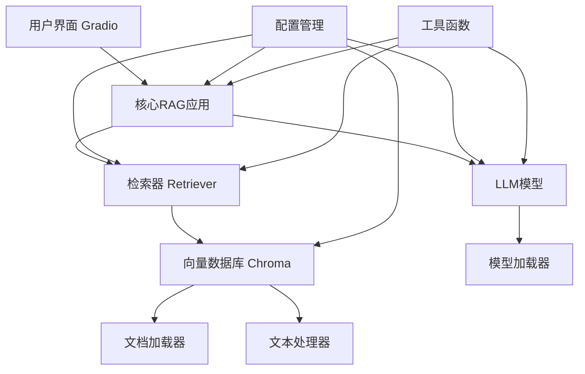
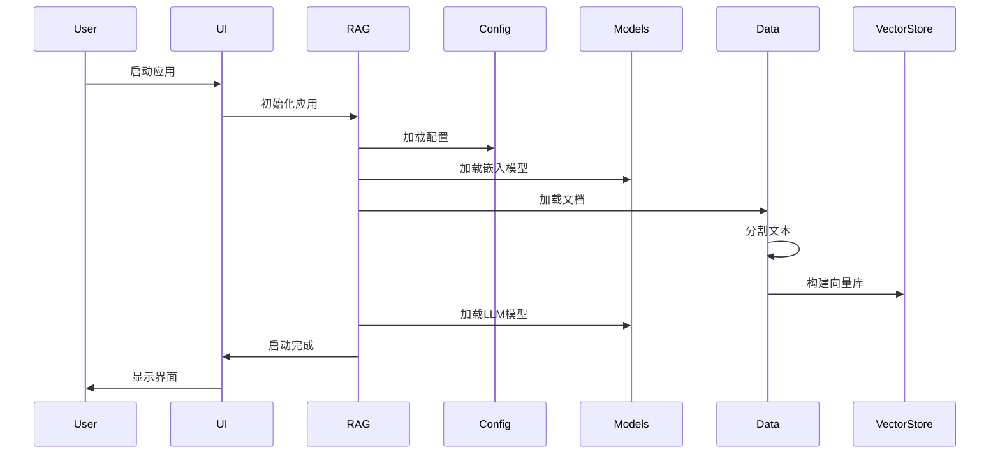
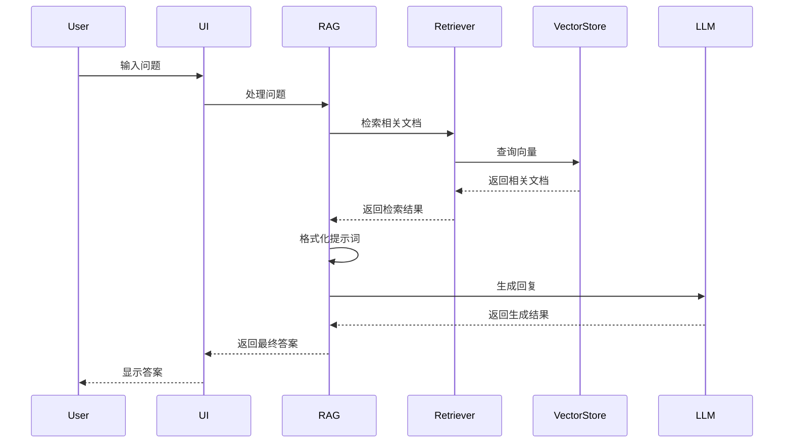

# 架构设计

本文档详细介绍离线智能法律咨询系统的架构设计和组件关系。

## 1. 系统架构

### 1.1 整体架构



### 1.2 模块关系

| 模块 | 主要职责 | 依赖关系 |
|------|----------|----------|
| **config** | 配置管理 | 所有模块 |
| **models** | 模型管理 | core模块 |
| **data** | 数据处理 | core模块 |
| **core** | 核心逻辑 | models, data, config |
| **ui** | 用户界面 | core模块 |

## 2. 核心组件

### 2.1 配置管理

**配置管理**负责系统的所有配置参数，包括：

- **SystemConfig**: 系统级配置参数
- **环境变量**: 动态配置支持
- **配置加载**: 初始化时加载所有配置

**设计特点**:
- 集中化管理
- 支持环境变量覆盖
- 类型安全
- 易于扩展

### 2.2 模型管理

**模型管理**负责模型的加载和推理：

- **EmbeddingFactory**: 嵌入模型工厂，支持多种嵌入模型
- **TinyHashEmbedding**: 轻量级哈希嵌入（用于健康检查）
- **LocalHFEmbedding**: 本地HuggingFace嵌入模型
- **Qwen7BModel**: Qwen-7B-Chat模型管理

**设计特点**:
- 工厂模式，支持多种模型
- 自动降级策略
- 支持4bit量化
- 设备自动分配

### 2.3 数据处理

**数据处理**负责文档的加载、处理和向量存储：

- **DocumentLoader**: 文档加载器，支持.txt和.md格式
- **TextProcessor**: 文本处理器，负责文本分割
- **VectorStoreManager**: 向量数据库管理器

**设计特点**:
- 支持多种文档格式
- 智能文本分割
- 重复文档检测
- 向量数据库自动管理

### 2.4 核心逻辑

**核心逻辑**是系统的大脑，负责协调各个组件：

- **LegalRAGApp**: RAG应用主类
- **Retriever**: 检索器，负责相关文档检索
- **Utils**: 工具函数，提供系统检查等功能

**设计特点**:
- 模块化设计
- 清晰的职责划分
- 易于扩展
- 完整的错误处理

### 2.5 用户界面

**用户界面**提供交互式的用户体验：

- **LegalRAGUI**: Gradio界面封装
- **聊天界面**: 支持对话式交互
- **响应式设计**: 适配不同设备

**设计特点**:
- 简洁友好
- 实时响应
- 易于使用
- 支持多种输入方式

## 3. 数据流

### 3.1 系统启动流程



### 3.2 问答流程



## 4. 设计原则

### 4.1 高内聚低耦合

- 每个模块职责单一
- 模块间通过明确的接口通信
- 减少模块间的直接依赖

### 4.2 可扩展性

- 支持多种模型
- 支持多种文档格式
- 支持多种检索策略
- 易于添加新功能

### 4.3 鲁棒性

- 优雅的降级策略
- 完善的错误处理
- 健康检查机制
- 离线运行支持

### 4.4 性能优化

- 4bit量化推理
- 批量处理
- 高效的向量检索
- 内存优化

### 4.5 易用性

- 简单的配置
- 直观的界面
- 详细的文档
- 完善的错误提示

## 5. 扩展点

### 5.1 支持更多模型

```python
# 示例：添加新模型
class NewModel:
    def __init__(self, model_path):
        # 模型初始化
        pass
    
    def generate(self, prompt):
        # 生成逻辑
        pass
```

### 5.2 支持更多文档格式

```python
# 示例：添加PDF支持
class PDFLoader:
    def load_pdf(self, file_path):
        # PDF加载逻辑
        pass
```

### 5.3 自定义检索策略

```python
# 示例：添加自定义检索
class CustomRetriever:
    def retrieve(self, query, k):
        # 自定义检索逻辑
        pass
```

## 6. 部署架构

### 6.1 本地部署

```
本地部署架构：
┌───────────────────────────────────────────────────────────┐
│                     客户端浏览器                          │
└───────────────────┬───────────────────────────────────────┘
                    │
┌───────────────────▼───────────────────────────────────────┐
│                     Gradio服务器                          │
└───────────────────┬───────────────────────────────────────┘
                    │
┌───────────────────▼───────────────────────────────────────┐
│                   LegalRAGApp                            │
├───────────────┬───────────────┬───────────────────────────┤
│  LLM模型      │ 嵌入模型      │ 向量数据库                │
└───────────────┴───────────────┴───────────────────────────┘
```

### 6.2 企业部署

```
企业部署架构：
┌───────────────────────────────────────────────────────────┐
│                     负载均衡器                            │
└───────────────────┬───────────────────────────────────────┘
                    │
┌───────────────────┴───────────────────────────────────────┐
│                     多实例部署                            │
│ ┌─────────────────────┐ ┌─────────────────────┐           │
│ │  Gradio服务器实例1  │ │  Gradio服务器实例2  │           │
│ └───────────┬─────────┘ └───────────┬─────────┘           │
│             │                       │                     │
│ ┌───────────▼───────────────────────▼───────────────────┐ │
│ │                   共享向量数据库                      │ │
│ └─────────────────────────────────────────────────────┘ │
└───────────────────────────────────────────────────────────┘
```

## 7. 监控与维护

### 7.1 系统日志

系统提供详细的日志信息，包括：
- 启动日志
- 模型加载日志
- 检索日志
- 生成日志
- 错误日志

### 7.2 健康检查

系统支持健康检查模式，通过 `DRY_RUN=1` 启动，仅测试系统组件，不加载模型。

### 7.3 常见问题排查

| 问题 | 可能原因 | 解决方案 |
|------|----------|----------|
| 模型未找到 | 模型路径错误 | 检查MODEL_ROOT配置 |
| 显存不足 | GPU显存不够 | 使用4bit量化或减少batch size |
| 文档未索引 | 文档格式错误 | 检查文档格式和路径 |
| 响应缓慢 | 模型过大 | 优化模型或增加硬件资源 |

## 8. 未来规划

### 8.1 架构优化

- 支持分布式部署
- 引入缓存机制
- 优化模型加载速度
- 支持模型热更新

### 8.2 功能扩展

- 支持更多模型
- 支持多语言
- 添加文档自动更新
- 支持批量查询

### 8.3 性能优化

- 优化检索算法
- 减少内存占用
- 提高生成速度
- 优化向量存储

---

**总结**: 离线智能法律咨询系统采用模块化、可扩展的架构设计，支持多种部署方式，具有良好的性能和可靠性。系统设计遵循高内聚低耦合、可扩展性、鲁棒性等原则，便于维护和扩展。
